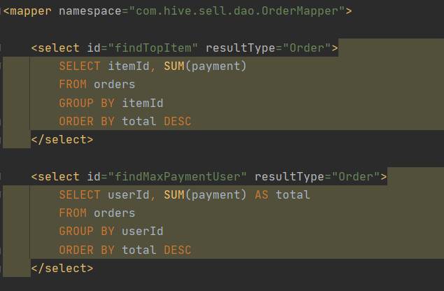

# 云计算课程项目报告

## 小组成员名单

| 姓名   | 学号    |
| ------ | ------- |
| 数据删除 | xxxxxxx |
| 数据删除 | xxxxxxx |
| 数据删除 | xxxxxxx |


## Hadoop 配置

### Master配置

1. 配置xml文件，详细配置请在附录查看

2. 格式化

```shell
hadoop namenode -format
```

3. 启动

```shell
start-dfs.sh
yarn --workers --daemon start nodemanager
yarn --daemon start resourcemanager
mapred --daemon start historyserver
```


#### 报错解决

多次格式化后，启动报错：

```shell
INFO org.apache.hadoop.ipc.Client: Retrying connect to server: master/192.168.1.240:9000. Already tried 6 time(s).
```

解决：删除所有机器的tmp，再格式化

```
rm -r ~/hadoop/tmp
```

```
hadoop namenode -format
```


### Worker配置

1. 改本机hostname

```shell
sudo hostname [yourhost]
```

2. 改etc/hosts

```shell
sudo vim /etc/hosts
```

```shell
[hostIP] dmhost
...
```

3. 建立hadoop_user账户

```shell
sudo groupadd hadoop
sudo useradd -s /bin/bash -d /home/hadoop_user -m hadoop_user -g hadoop
sudo passwd hadoop_user
```

7. 安装ssh

```shell
sudo apt-get install ssh
```

8. 生成公钥和私钥

```shell
ssh-keygen -t rsa -P ''
```

9. 授权

```shell
cd .ssh
cat id_rsa.pub >> authorized_keys
chmod 600 authorized_keys
```

10. 测试ssh无密码登录

```shell
ssh [yourhost]
```

记得退出

```shell
exit
```

11. 授权给主节点

```shell
scp hadoop_user@dmhost:~/.ssh/id_rsa.pub ./master_rsa.pub
cat master_rsa.pub >> authorized_keys
```

- 主节点测试能否ssh无密码登录

---

12. jdk安装，安装过就不用再装

```shell
sudo apt-get install java-8-openjdk-amd64
```

13. 配环境变量

```shell
vim ~/.bashrc
```

在文件末尾加入

```shell
export JAVA_HOME=[your java path]
export HADOOP_HOME=/home/hadoop_user/hadoop
export PATH=$PATH:$JAVA_HOME/bin:$HADOOP_HOME/bin:$HADOOP_HOME/sbin
```

14. 测试

```shell
java -version
```

- 主机复制配置文件到分机

---


15. 测试

```shell
hadoop version
```

16. 更改hadoop-env.sh

```shell
cd /home/had_usr/hadoop/etc/hadoop
vim hadoop-env.sh
```

增加JAVA_HOME地址

```shell
export JAVA_HOME=/usr/lib/jvm/java-8-openjdk-amd64
```

17. 更改yarn-env.sh

同上，增加JAVA_HOME


## Hive 配置

### 配置流程

- 解压

```sh
tar -zxvf apache-hive-3.1.2-bin.tar.gz
```

- 文件夹改名

```sh
mv apache-hive-3.1.2-bin hive
```

- 配置环境变量

```sh
vim ~/.bashrc
```

```sh
export HIVE_HOME=/home/hadoop_user/hive
export PATH=...:$HIVE_HOME/bin
```

- 配置文件

#### hive-env.sh

```shell
cd /opt/apache-hive-2.3.4-bin/conf/
cp hive-env.sh.template hive-env.sh
vi hive-env.sh
```

增加：

```sh
# HADOOP_HOME=${bin}/../../hadoop
export HADOOP_HOME=/home/hadoop_user/hadoop

# Hive Configuration Directory can be controlled by:
export HIVE_CONF_DIR=/home/hadoop_user/hive/conf

# Folder containing extra libraries required for hive compilation/execution can be controlled by:
export HIVE_AUX_JARS_PATH=/opt/hive/lib
export JAVA_HOME=/usr/lib/jvm/java-8-openjdk-amd64/jre/bin/java
```


#### hive-site.xml

```shell
cp hive-default.xml.template hive-site.xml 
vi hive-site.xml 
```

文件内容：

```xml
<property>
    <name>hive.exec.scratchdir</name>
    <value>/home/hadoop_user/tmp/hive</value>
    <description>HDFS root scratch dir for Hive jobs which gets created with write all (733) permission. For each connecting user, an HDFS scratch dir: ${hive.exec.scratchdir}/&lt;username&gt; is created, with ${hive.scratch.dir.permission}.</description>
</property>

<property>
    <name>hive.exec.local.scratchdir</name>
    <value>/home/hadoop_user/tmp/hive/local</value>
    <description>Local scratch space for Hive jobs</description>
</property>

<property>
    <name>hive.downloaded.resources.dir</name>
    <value>/home/hadoop_user/tmp/hive/resources</value>
    <description>Temporary local directory for added resources in the remote file system.</description>
</property>


<property>
    <name>javax.jdo.option.ConnectionURL</name>
    <value>jdbc:mysql://rm-uf625zzwv7f07c5s4fo.mysql.rds.aliyuncs.com:3306/bookstore?createDatabaseIfNotExist=true</value>
    <!-- &amp;allowPublicKeyRetrieval=true -->
    <description>
      JDBC connect string for a JDBC metastore.
      To use SSL to encrypt/authenticate the connection, provide database-specific SSL flag in the connection URL.
      For example, jdbc:postgresql://myhost/db?ssl=true for postgres database.
    </description>
</property>

<property>
    <name>javax.jdo.option.ConnectionPassword</name>
    <value>YunJiSuan24680</value>
    <description>password to use against metastore database</description>
</property>

<property>
    <name>javax.jdo.option.ConnectionDriverName</name>
    <value>com.mysql.cj.jdbc.Driver</value>     <!-- com.mysql.jdbc.Driver -->
    <description>Driver class name for a JDBC metastore</description>
</property>

<property>
    <name>javax.jdo.option.ConnectionUserName</name>
    <value>cloud_computing</value>
    <description>Username to use against metastore database</description>
</property>
```

##### 端口配置一览

| 字段                                 | 值 |
| ------------------------------------ | ----- |
| hive.metastore.port                  | 7083  |
| hive.server2.thrift.http.port        | 10001 |
| hive.server2.webui.port              | 10002 |
| hive.server2.thrift.port             | 11000 |
| 以下不使用                           |       |
| hive.zookeeper.client.port           | 2181  |
| ...                                  |       |
| hive.llap.daemon.output.service.port | 15003 |
| hive.llap.daemon.web.port            | 15002 |
| ...                                  |       |


##### 远程连接配置

- hive-site.xml

```xml
<property>
	<name>hive.server2.thrift.port</name>
    <value>11000</value>
</property>
<property>
 	<name>hive.server2.thrift.bind.host</name>
    <value>47.112.129.193</value>
</property>
```

- core-site.xml (hadoop)

```xml
<property>
	<name>hadoop.proxyuser.hadoop_user.hosts</name>
	<value>*</value>
</property>
<property>   
	<name>hadoop.proxyuser.hadoop_user.groups</name>
    <value>*</value>
</property>
```

- hdfs-site.xml

```xml
<property>
    <name>dfs.webhdfs.enabled</name>
    <value>true</value>
</property>
```


#### JDBC驱动

将mySql的JDBC驱动包复制到Hive的lib目录下 

下载mysql-connector-java-8.0.21.zip，上传jar包

```shell
cp /home/root/download/mysql-connector-java-8.0.21.jar  ~/hive/lib
```


#### 初始化

- 需要初始化数据库，在bin目录下

  ```
  ./schematool -dbType mysql -initSchema
  ```

  

#### 启动hive

- 启动hadoop

- 启动hive

```shell
cd ~/hive/bin
nohup ./hive --service metastore >> ~/hive/metastore.log 2>&1 &
nohup ./hive --service hiveserver2 >> ~/hive/hiveserver2.log 2>&1 &
```

- 测试

```
hive> show databases;
hive> use xxdb;
hive> show tables;
```


#### 启动远程连接

进入hive根目录，启动hiveserver2

```shell
nohup ./hive --service metastore >> ~/hive/metastore.log 2>&1 &
```

```shell
nohup ./hive --service hiveserver2 >> ~/hive/hiveserver2.log 2>&1 &
```

查日志

```
vi ~/hive/metastore.log
```

启动要等很久，直到能查到端口

```shell
lsof -i:11000
```


- beeline

这里打开一个进程会停住，另开一个terminal，进入beeline，

```
!connect jdbc:hive2://47.112.129.193:11000
```

输入用户名和密码连接

退出：

```
!exit
```

之后可查看连接状态

```
http://47.112.129.193:10002/
```


### 报错解决

#### log4j

```
SLF4J: Class path contains multiple SLF4J bindings.
SLF4J: Found binding in [jar:file:/home/hadoop_user/hive/lib/log4j-slf4j-impl-2.10.0.jar!/org/slf4j/impl/StaticLoggerBinder.class]
SLF4J: Found binding in [jar:file:/home/hadoop_user/hadoop/share/hadoop/common/lib/slf4j-log4j12-1.7.25.jar!/org/slf4j/impl/StaticLoggerBinder.class]
```

解决：jar包冲突

```shell
rm /home/hadoop_user/hive/lib/log4j-slf4j-impl-2.10.0.jar
```


#### No Such Method

```
Exception in thread "main" java.lang.NoSuchMethodError: com.google.common.base.Preconditions.checkArgument(ZLjava/lang/String;Ljava/lang/Object;)
```

关键在： com.google.common.base.Preconditions.checkArgument 这是因为hive内依赖的**guava.jar**和hadoop内的**版本不一致**造成的。 检验方法：

1. 查看hadoop安装目录下share/hadoop/common/lib内guava.jar版本(guava-27.0-jre.jar )
2. 查看hive安装目录下lib内guava.jar的版本(guava-19.0.jar)
3. 如果两者不一致，删除版本低的，并拷贝高版本的 问题解决！

```shell
cd ~/hive/lib
rm guava-19.0.jar
cp ~/hadoop/share/hadoop/common/lib/guava-27.0-jre.jar .
```


#### Illegal character entity

```
Exception in thread "main" java.lang.RuntimeException: com.ctc.wstx.exc.WstxParsingException: Illegal character entity: expansion character (code 0x8
 at [row,col,system-id]: [3217,96,"file:/home/hadoop_user/hive/conf/hive-site.xml"]
```

存在非法字符，把该行 &#8 删掉


#### java.net.ConnectException

```
Exception in thread "main" java.lang.RuntimeException: java.net.ConnectException: Call From dmhost/172.31.53.109 to dmhost:9020 failed on connection exception: java.net.ConnectException: Connection refused;
```

没启动hadoop，先启动


#### java.net.URISyntaxException

```
Exception in thread "main" java.lang.IllegalArgumentException: java.net.URISyntaxException: Relative path in absolute URI: ${system:java.io.tmpdir%7D/$%7Bsystem:user.name%7D
```

需要在hive-site.xml内设置：

hive.exec.local.scratchdir

hive.downloaded.resources.dir


#### Error creating transactional connection factory

```console
MetaException(message:Error creating transactional connection factory)
    at org.apache.hadoop.hive.metastore.RetryingHMSHandler.<init>(RetryingHMSHandler.java:84)
    at org.apache.hadoop.hive.metastore.RetryingHMSHandler.getProxy(RetryingHMSHandler.java:93)
    ...
```

没启动mysql


#### Unable to instantiate

hive> show databases:

```
FAILED: HiveException java.lang.RuntimeException: Unable to instantiate org.apache.hadoop.hive.ql.metadata.SessionHiveMetaStoreClient
```

需要初始化数据库，在bin目录下

```
./schematool -dbType bookstore -initSchema
```

schematool: command not found：要加./


## 后端 Spring Boot 架构


### Pojo Layer

The Pojo Layer is actually a database entity layer, where a table in a database corresponds to an entity class, and the class attribute corresponds to the table field one-to-one. 

In our project, we design and create database at first and then ctreate classes in the Pojo Layer according to the attributes and types of the database. Just as the picture belowing shows, we create ten entity classes in the Pojo Layer corresponding to ten tables in the database.

In each entity class, we declare private variables relating to attributes in the corresponding table. What's more, we use @TabledId above some variable to show that it is the primary key in the database and use @TableField to show it is which attribute in the database. Also, we can add some variables which does not exists in the database but will be used later. In the end, we use label @AllArgsConstructor, @NoArgsConstructor to create constructed function for the class and use label @Data, @ToString to repalce getter and setter function in the class for the sake of visiting its private variables in the following by installing a plugin named 'Lombock'.

*EXAMPLE: Order.java*


 

### Dao Layer

The Dao Layer(Mapper Layer) is a data persistence layer. The Mapper Layer plays a role in visiting database to complete the task of inserting, deleting, updating and selecting data through sending SQL statement to the database.

We create ten Mapper interfaces corresponding to ten Pojo classes. In the each Mapper interface, we declare the specific function to be implemented. Each function realizes a specific operation of inserting or deleting or updating or selecting data. Label @Mapper can automatically generate an implementation class based on an interface.

And then we write their SQL statements in a mapper.xml file. We bind mapper.xml file to some mapper interface through setting up 'namespace' and bind an operation to a concrete function by using 'id'. The resultType represents the return type. And then we write specific SQL statement.

*EXAMPLE: OrderMapper.java*



 

### Service Layer

The Service Layer is business logic layer which realize functional design. The Service Layer implements the Dao Layer interface. It invokes functions from the Dao Layer, receives the data returned by the Dao Layer and completes the basic function design of the project.

In the Service Layer, we create Service interfaces and ServiceImpl classes implementing Service interfaces. We invoke the function in the Dao Layer to realize the override function. Label @Transactional makes all public methods of this class have transaction attributes of this type. It essentially uses JDBC transactions for transaction control. At the beginning of the transaction, through the AOP mechanism, a proxy connection object is generated and placed in a container of the DataSource instance related to the DataSourceTransactionManager. In the entire next transaction, the client code should use this connection to connect to the database and execute all database commands. At the end of the transaction, roll back the database command executed on the proxy connection object, and then close the proxy connection object. 

*EXAMPLE: IOrderService.java*


 *EXAMPLE: OrderService.java*


### Controller Layer

The function of the Controller Layer is to request and to response control. The Controller Layer is responsible for front-end and back-end interactions. It accepts front-end requests, calls the service layer and then receives data returned by the service layer. Finally, it returns specific pages and data to the client.

In the Controller Layer, we invokes function from the Service Layer and complete specific data interaction. Label @RequestMapping is an annotation used to process request address mapping, which can be used on classes or methods. Used on the class, it means that all the methods in the class that respond to the request use this address as the parent path. We use label @PutMapping, @GetMapping, @PostMapping, @DeleteMapping to handle put, get, post, delete request to help simplify the mapping of commonly used HTTP methods and better express the semantics of annotated methods.

*EXAMPLE: OrderController.java*


## 前端 Ant Design Pro React 架构

### 路由配置

前端设置了 `Statistics` 一级路由，以及其下的 `GeneralStatistics`、`GoodsStatistics`、`UserStatistics` 三个二级路由。每个路由在 `pages` 文件夹中都有对应的页面。路由设置的具体代码如下：

```JavaScript
routes: [
  {
    path: '/',
    redirect: '/statistics/general-statistics',
  },         
  {
    path: '/statistics',
    name: 'statistics',
    icon: 'table',
    routes: [
      {
        name: 'list.general-list',
        path: '/statistics/general-statistics',
        component: './Statistics/GeneralStatistics',
      },
      {
        name: 'list.user-list',
        path: '/statistics/user-statistics',
        component: './Statistics/UserStatistics',
      },
      {
        name: 'list.goods-list',
        path: '/statistics/goods-statistics',
        component: './Statistics/GoodsStatistics',
      },
    ],               
  },                                                        
  {
    component: './404',
  },
],
```

### 布局设计

每个数据统计页面使用 `PageContainer` 作为页面整体的容器，并使用 `Grid` 方式对组件进行排列。统计图表使用了 `BizCharts` 的 `Chart` 及配套组件。数据表格使用 `Ant Design` 的 `Table` 组件。以 `GeneralStatistics` 页面为例，其布局部分的代码如下：

```JavaScript
<PageContainer>
  <div className="general-statistics-wrapper">
    <Row gutter={16}>
      <Col span={24}>
        <Card title={chosenGoodsName} style={{ width: '100%' }}>
          <Chart
            padding={[10, 20, 50, 50]}
            autoFit
            height={300}
            data={dailyData}
            scale={{ 销售额: { min: 0 } }}
          >
            <Line position="date*销售额" />
            <Point position="date*销售额" />
            <Tooltip showCrosshairs triggerOn='hover' />
          </Chart>
        </Card>
      </Col>
    </Row>
  </div>
  <Divider />
  <Table
    dataSource = {dataList}
    columns = {columns}
  />
</PageContainer>
```

### 数据流向

前端内部数据采用 React 自带的方式来管理，用 useState 和 useEffect 对数据进行变更和控制，示例代码如下：

```JavaScript
const [dataList, setDataList] = useState([]);
const [ chosenGoodsName,setChosenGoodsName] = useState("请选择商品");
useEffect(
() => {
  getAllItems().then((res) => {
    setDataList(res.data);
  })
}, []);

const [dailyData, setDailyData] = useState([]);
```


## 附录

### 页面展示

- 总体数据，展示销售额最高的商品、购买额最高的用户，和近日总销售额曲线


- 订单按时间/金额排序，具有分页查找功能


- 用户数据页面，选中用户，展示TA近日每日购买金额


- 用户数据分页查询


- 商品数据页面，选中商品，展示近日每日销售总额


- 商品数据分页查询


### Hadoop文件配置

- core-site.xml

  ```xml
  <configuration>
          <property>
                  <name>hadoop.tmp.dir</name>
                  <value>/home/had_usr/hadoop/tmp</value>
                  <description>Abase for other temporary directories.</description>
          </property>
          <property>
                  <name>fs.defaultFS</name>
                  <value>hdfs://dmhost:8020</value>
          </property>
  
  </configuration>
  ```

  

- hdfs-site.xml

  ```xml
  <configuration>
          <property>
                  <name>dfs.replication</name>
                  <value>3</value>
          </property>
          <property>
                  <name>dfs.namenode.name.dir</name>
                  <value>file:/home/had_usr/hadoop/tmp/dfs/name</value>
          </property>
          <property>
                  <name>dfs.datanode.data.dir</name>
                  <value>file:/home/had_usr/hadoop/tmp/dfs/data</value>
          </property>
          <property>
                  <name>dfs.namenode.http-address</name>
                  <value>dmhost:9870</value>
          </property>
          <property>
                  <name>dfs.namenode.secondary.http-address</name>
                  <value>tzyhost:50090</value>
          </property>
          <property>
                  <name>dfs.webhdfs.enabled</name>
                  <value>true</value>
          </property>
  </configuration>
  ```

  

- mapred-site.xml

  ```xml
  <configuration>
          <property>
                  <name>mapreduce.framework.name</name>
                  <value>yarn</value>
          </property>
          <property>
                  <name>yarn.app.mapreduce.am.env</name>
                  <value>HADOOP_MAPRED_HOME=/home/had_usr/hadoop</value>
          </property>
          <property>
                  <name>mapreduce.map.env</name>
                  <value>HADOOP_MAPRED_HOME=/home/had_usr/hadoop</value>
          </property>
          <property>
                  <name>mapreduce.reduce.env</name>
                  <value>HADOOP_MAPRED_HOME=/home/had_usr/hadoop</value>
          </property>
          <property>
                  <name>mapreduce.jobhistory.address</name>
                  <value>lyfhost:10020</value>
          </property>
          <property>
                  <name>mapreduce.jobhistory.webapp.address</name>
                  <value>lyfhost:19888</value>
          </property>
  </configuration>
  ```

  

- yarn-site.xml

  ```xml
  <configuration>
  
  <!-- Site specific YARN configuration properties -->
          <property>
                  <name>yarn.nodemanager.aux-services</name>
                  <value>mapreduce_shuffle</value>
          </property>
          <property>
                  <name>yarn.nodemanager.localizer.address</name>
                  <value>0.0.0.0:8140</value>
          </property>
          <property>
                  <name>yarn.resourcemanager.hostname</name>
                  <value>dmhost</value>
          </property>
          <property>
                  <name>yarn.resourcemanager.webapp.address</name>
                  <value>dmhost:8088</value>
          </property>
          <property>
                  <name>yarn.log-aggregation-enable</name>
                  <value>true</value>
          </property>
          <property>
                  <name>yarn.log-aggregation.retain-seconds</name>
                  <value>604800</value>
          </property>
          <property>
                  <name>yarn.log.server.url</name>
                  <value>http://lyfhost:19888/jobhistory/logs</value>
          </property>
  
  </configuration>
  ```

  